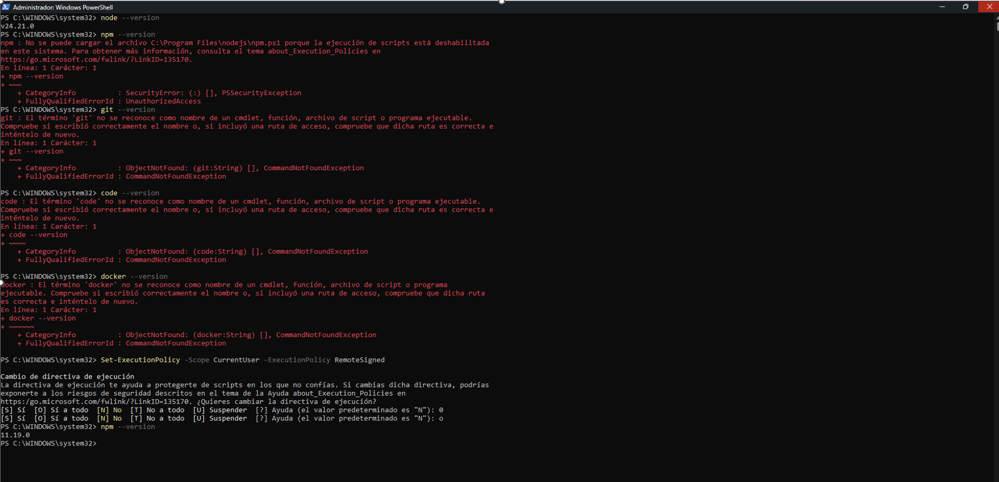

# Guía 01: Configuración del Entorno, Repositorio y Caso de Estudio\
Jordy Julian Huamán Lozano\

## Breve descripción del curso
* **Asignatura:** IS-488 Arquitectura de Software 
* **Docente:** Ing. Lizbeth Jaico Quispe

## Expectativas del curso
Espero entender qué hace un arquitecto de software y cómo toma decisiones técnicas, conociendo las distintas formas de organizar un sistema y sus ventajas y desventajas. \

## Evidencias

